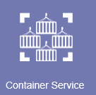

# Azure Container Services (AKS) - Hands-on Lab Script

Mark Harrison : 7 Apr 2018



- [Part 1 - Azure Container Service (AKS)](aks-1.md)
- [Part 2 - Helm Package Management](aks-2.md)  ... this document
- [Part 3 - Monitoring Kubernetes](aks-3.md)

## Helm

[Kubernetes Helm](https://github.com/kubernetes/helm) is a tool for installing packages of pre-configured Kubernetes resources.

Discover & launch  Kubernetes-ready apps at <https://hub.kubeapps.com/> 

### Install

To install Helm on Windows, use the Chocolately package at <https://chocolatey.org/packages/kubernetes-helm> 


Helm has two parts: a client (Helm) and a server (Tiller)
Tiller runs inside of your Kubernetes cluster, and manages releases (installations) of your charts (packages).

To install the Tiller, use the command:

```text
helm init
```

We can see that the Tiller has been installed as a Pod 


### Example - WordPress

WordPress is one of the most versatile open source content management systems on the market. A publishing platform for building blogs and websites.  There is a Helm chart for installing Wordpress and the associated MariaDB database. <https://hub.kubeapps.com/charts/stable/wordpress>

To install WordPress use the command:

```PowerShell
helm install --name wordpress `
    --set wordpressUsername=admin,wordpressPassword=password,mariadb.mariadbRootPassword=secretpassword `
    stable/wordpress
```


A short period is required for the external load balancer to be created and the WordPress application to be exposed as a service.  We can get the IP address from the command:

```PowerShell
kubectl get svc --namespace default -w wordpress-wordpress
```


The WordPress administration is at <http://external-ipaddress/admin>


The WordPress blog is at <http://external-ipaddress/>


To remove the WordPress deployment, use the following command

```PowerShell
Helm delete --purge wordpress
```


---
[Home](aks-0.md) | [Prev](aks-1.md) | [Next](aks-3.md)