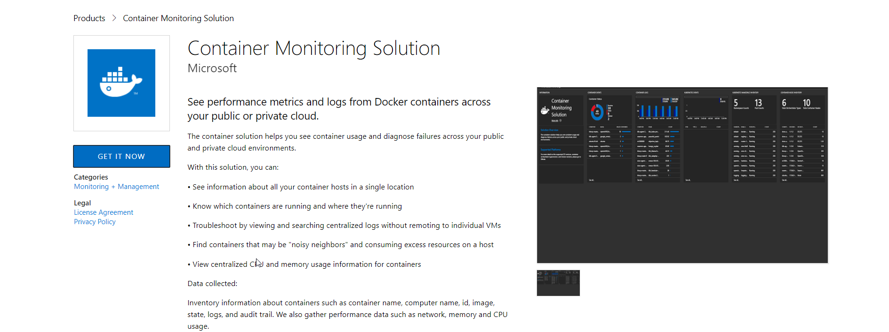
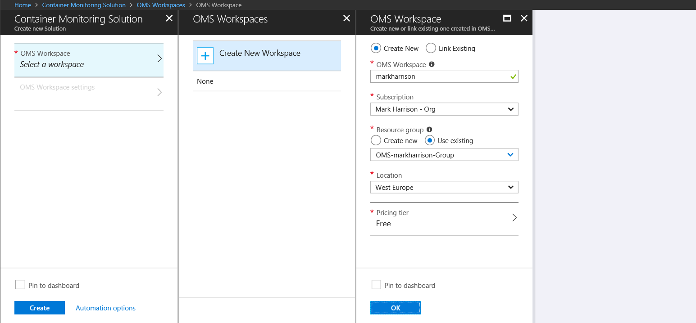
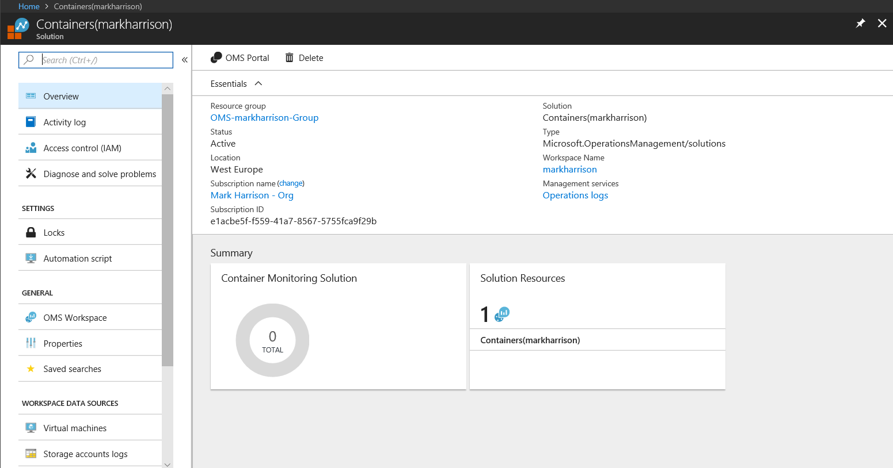
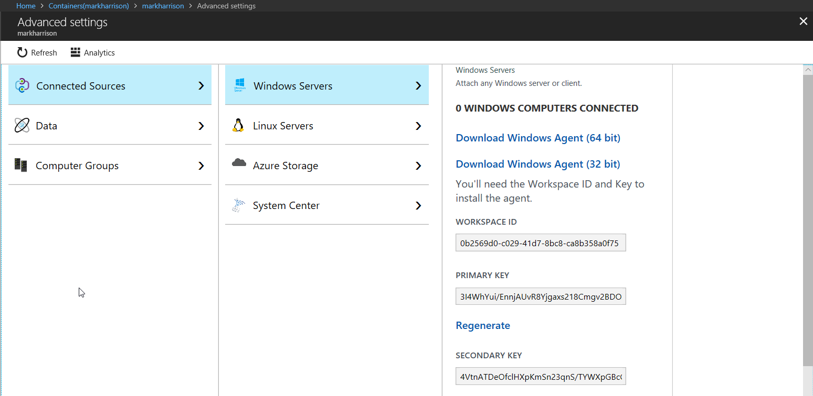
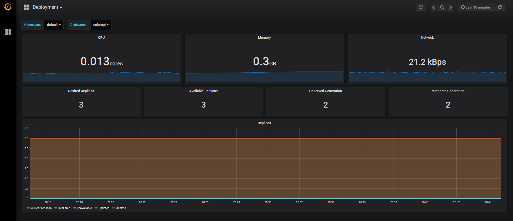

# Azure Container Services (AKS) - Hands-on Lab Script

Mark Harrison : 7 Apr 2018


- [Part 1 - Azure Container Service (AKS)](aks-1.md)
- [Part 2 - Helm Package Management](aks-2.md) 
- [Part 3 - Monitoring Kubernetes](aks-3.md) ... this document

## Overview

In this section, we shall monitor our Kuberntes cluster using:

- Azure Log Analytics 
- Prometheus / Grafana - open source toolkit to monitor and alert
- Datadog - commercial monitoring offering 

## Azure Log Analytics

[Log Analytics](https://azure.microsoft.com/en-gb/services/log-analytics/) is part of Operations Management Suite (OMS), Microsoft Azure's overall management solution. Log Analytics monitors cloud and on-premises environments to maintain availability and performance. It provides insight across workloads and systems to maintain availability and performance.

Log Analytics management solutions are a collection of logic, visualization, and data acquisition rules that provide metrics pivoted around a particular problem area.

The [Container Monitoring solution](https://docs.microsoft.com/en-gb/azure/log-analytics/log-analytics-containers) shows which containers are running, what container image they’re running, and where containers are running. You can view detailed audit information showing commands used with containers. And, you can troubleshoot containers by viewing and searching centralized logs without having to remotely view Docker or Windows hosts. You can find containers that may be noisy and consuming excess resources on a host. And, you can view centralized CPU, memory, storage, and network usage and performance information for containers.

### Install

Add the Container Monitoring solution to your OMS workspace from Azure marketplace https://azuremarketplace.microsoft.com/en-us/marketplace/apps/microsoft.containersoms



This will take you to the configuration blade in the management portal : https://portal.azure.com/#create/Microsoft.ContainersOMS

Either select an existing OMS workspace or create a new one.



Select create solution



Select the OMS Workspace and go to Advance Settings - this will display the workspace id and key - these are needed when configuring our logging solution enabling it to communicate with our workspace.



Next we shall use Helm to install the OMS daemonset on our Kubernetes cluster.

(Update - a newer / simpler alternative to using Helm is the command: `az aks enable-addons -a monitoring -n markaks` )

```PowerShell

helm install --name omsagent --namespace monitoring  `
  --set omsagent.secret.wsid=<your_workspace_id>,omsagent.secret.key=<your_workspace_key> stable/msoms

```


After a short period of time, information from the cluster will start to be surfaced into the OMS workspace.

### Log Analytics - Container Monitoring Solution

The Container Monitoring Solution can be displayed either in the Azure managament portal or a standalone OMS portal - the latter gives a bit more screen estate.


Log Analytics has a query language that allows you to search terms, identify trends, analyze patterns, and provide many other insights based on your data. 

- Visit [Getting Started](https://docs.loganalytics.io/docs/Learn/Getting-Started/Getting-started-with-queries) with Queries to learn how to write new queries.

- Use the [Query Language Reference](https://docs.loganalytics.io/docs/Language-Reference) for details on functions, operators and types

Some sample queries are given on the right hand panel of the Container Monitoring Solution.

Example:

```text
Perf
| where ObjectName == "Container" and CounterName == "Memory Usage MB" and (InstanceName contains "k8s_colorapi")
| summarize AvgMemory = avg(CounterValue) by InstanceName
```


- Select the Advance Analytics link


### Tidy Up

We can use Helm to remove the OMS daemonset ...

```PowerShell
helm list
helm delete --purge omsagent
```


## Prometheus / Grafana

### Install

To install  Prometheus / Grafana, use the commands:

```PowerShell
helm repo add coreos https://s3-eu-west-1.amazonaws.com/coreos-charts/stable/

helm install coreos/prometheus-operator --name prometheus-operator --namespace monitoring `
        --set rbacEnable=false

helm install coreos/kube-prometheus --name kube-prometheus --namespace monitoring `
        --set global.rbacEnable=false
```


To access the Web UIs we need to port forward as below, and then access with a browser on the appropriate port

### Prometheus

```text
kubectl port-forward -n monitoring prometheus-kube-prometheus-0 9090
```


Prometheus provides a functional expression language that lets the user select and aggregate time series data in real time. The result of an expression can either be shown as a graph, viewed as tabular data in Prometheus's expression browser, or consumed by external systems via the HTTP API.  Information at https://prometheus.io/docs/prometheus/latest/querying/basics/ 

Example query:

- ```container_memory_rss{container_name="colorapi"}```


### Grafana

```text
kubectl port-forward $(kubectl get pods --selector=app=kube-prometheus-grafana -n monitoring `
            --output=jsonpath="{.items..metadata.name}") -n monitoring 3000
```


Grafana is a leading graph and dashboard builder for visualizing time series infrastructure and application metrics, and includes support for Prometheus datasources.

- Select the Node dashboard


- Select the Deployment dashboard, and then select the ColorAPI deployment



- Select the Pod dahsboard, and then select one of the ColorAPI containers


### AlertManager

```text
kubectl port-forward -n monitoring alertmanager-kube-prometheus-0 9093
```


[Alertmanager](https://prometheus.io/docs/alerting/alertmanager/) handles alerts sent by client applications such as the Prometheus server. It takes care of deduplicating, grouping, and routing them to the correct receiver integration such as email, PagerDuty, or OpsGenie. It also takes care of silencing and inhibition of alerts.

### Tidy Up

We can use Helm to remove Prometheus / Grafana ... 

```PowerShell
helm list
helm delete --purge kube-prometheus
helm delete --purge prometheus-operator

```


## DataDog

[Datadog](https://www.datadoghq.com/) is a commercial monitoring service that can gathers monitoring data from our Kubernetes cluster.  There is a free tier and free trial.

### Install

There is a Helm chart to install the Datadog Agent 

```PowerShell
helm install --name datadog --namespace monitoring     `
    --set datadog.apiKey=<yourapikey>,rbac.create=false,kube-state-metrics.rbac.create=false stable/datadog
```


After a short period of time, the agent will start reporting information to the the DataDog service

### DataDog monitoring

Monitoring informtation is surfaced at : https://app.datadoghq.com/event/stream

We can inspect our containers


### Tidy Up

We can use Helm to remove the DataDog agent ...

```PowerShell
helm list
helm delete --purge datadog
```


---
[Home](aks-0.md) | [Prev](aks-1.md)
